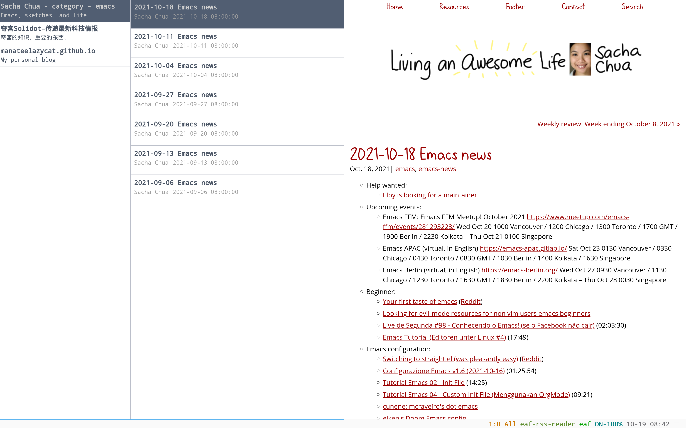

### EAF RSS Reader

<p align="center">
  
</p>

RSS Reader application for the [Emacs Application Framework](https://github.com/emacs-eaf/emacs-application-framework).

### Load application

```Elisp
(add-to-list 'load-path "~/.emacs.d/site-lisp/eaf-rss-reader/")
(require 'eaf-rss-reader)
```

### The keybinding of EAF RSS Reader.

| Key   | Event   |
| :---- | :------ |
| `A` | add_feed |
| `R` | remove_feed |
| `g` | handle_refresh_rsshub_list |
| `n` | js_select_next_feed |
| `p` | js_select_prev_feed |
| `j` | js_select_next_article |
| `k` | js_select_prev_article |
| `<f12>` | open_devtools |

